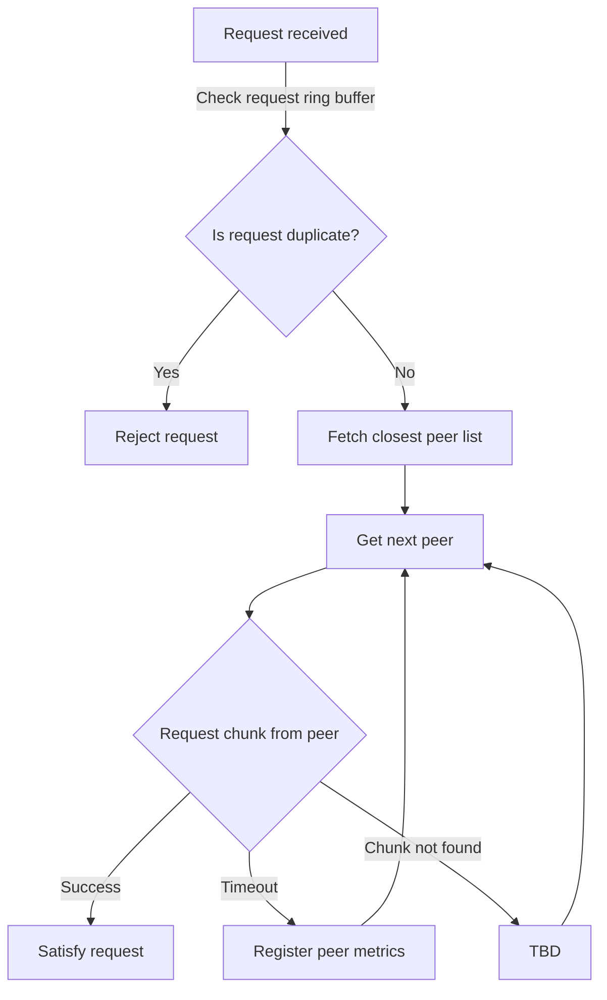

# Data syncing protocols specifications

## Abstract

An attempt to describe the desired, theoretical behavior of the main data syncing protocols of Swarm Bee. 
The main focus will be the PushSync, Retrieval, PullSync and Kademlia communication protocols.

## Introduction

A communications protocol is a set of formal rules describing how to transmit or exchange data, especially across a network. 
Finite-state machine models are used to formally describe the possible interactions of the protocol and communicating finite-state machines. 
While ideally specialized tools (TLA+ etc) could be employed to verify the correctness of the specifications, perhaps a simpler approach would be to start off with an ad-hoc combinatorics approach (permutations) to explore the state space and enforce invariants.

## Proposal

At the moment there isn’t a single source of truth about WHATs and HOWs of the data syncing protocols. 
There is the observed behavior that is coded into the repository inherited from the previous iterations of the project - however - except for the high level description of the expectations that can be found in <a href="/the-book-of-swarm.pdf" target="_blank" rel="noopener noreferrer">The Book of Swarm</a> - there’s no specific, tangible and actionable documentation that we can referred to when implementing and reasoning about specific protocols.
This is not an optimal situation for successful development because on the code level an observer would look at both the WHYs and the HOWs, concepts that are easy to confuse and even easier to misinterpret in a multi-threaded environment like ours.

The purpose of this document is to specify these two concepts separately:

- The set of rules by which a protocol would function, or, in other words a concise language that the protocol would speak to its peers to ensure that no uncharted states would be encountered. 
Here’s where the FSM pattern can be used to ensure proper test coverage.

- The scheduler whose purpose is to keep track of all the ongoing units of work, most frequently an attempt to deliver/retrieve a chunk to/from its destination. 
The scheduler enables multiple chunks to be synced concurrently while the steps of synchronization of an individual chunk would be sequential.
More details can be found in the “Definition format” section below.

### Simulations

If previous steps are completed correctly that would enable us to write simulations that do not take into consideration the nature of the transport layer, but are able to explore the behavior of the sync protocols in a “sterile” environment - by initializing an in-memory a set of the aforementioned schedulers and providing an ad-hoc medium of communication for them as a substitute for the TCP/IP (and other layers) that they would use in real world applications.

This set of in-memory objects can be connected to each other using a predefined configuration, allowing us to simulate “starved” neighborhoods or any other less-than-ideal situation.
By streaming a collection of chunks into one of this object we can employ various observability methods to make sure that the system overall is not entering a “cascading failure mode” or that is using the expected amount of memory and bandwidth, as well as abiding by a theoretically computed number of “in-flight” units of work (limits of parallelism).

# Protocols

## Retrieval

The retrieval of a chunk is a process which fetches a given chunk from the network by its address. Since Swarm involves a direct storage scheme of fixed size where chunks are stored on nodes with address corresponding to the chunk address the retrieval protocol involves reaching those neighborhoods wherever the request is initiated. Such a route is sure to exist as a result of the Kademlia topology of keep-alive connections between peers. The process of relaying the request from the initiator to the storer is called forwarding and also the process of passing the chunk data along the same path is called backwarding. If we zoom into a particular node in the forwarding path we see the following strategy:

- Receive a retrieve request
- Decide who to forward the request to
- Have a way to match the the response to the original request
- The crucial part of this strategy is choosing the peer to forward the request to and how they react to failure like stream closure or nodes dropping offline or closing the protocol connection and whether they proactively initiate several requests to peers.

Further considerations are:

- We need a way to ensure that this request has not been received recently (enough) before. Are we dealing with a spamming attack?
- We need a function that would sort a list of peer addresses in relation to their proximity to a given (chunk) address. If the first peer does not respond in time to our request (times out), we continue with the next best option.
- We need a way to ensure that when we issue a retrieval request we don’t end up in a situation when this request comes back around to us, wasting network resources.
- In the case when we are a “backwarder” node, we might consider caching the chunk in the event of a repeated request.
- If we receive a response to an expired request, or we are unable to conclude if such a request has ever been issued, we need a strategy to discourage the behavior of sending us such unsolicited chunks.
- We need to design the optimal incentivisation scheme, to determine the optimal payment/settlement frequency and correctness of computation of the payment/charged amount.
- We need to have a sensible wait/time out strategy; as a forwarder, we want to make our best effort to retrieve the chunk but without waiting for excessive amounts of time, which would lead to waste of resources.
- We need a strategy to discourage or blocklist peers who repeatedly return chunks that do not pass validation.

### Proposal pseudocode

```php

const { REQ_T: time delay for throtlling retreive requests from a given peer }

BEGIN: retrieve request

input { requester, chunkAddress }

state { requestLog, kademlia, accounting }

ACTION: result <= query $requestLog for past requests coming from the $requester for the same $chunkAddress within timespan $REQ_T

if such $result is found and $result indicates a successful previous chunk request do
  take punishing measures against the $requester (blocklisting?)

ACTION: candidatePeers <= query $kademlia for a sorted list of peers in order of their closeness to $chunkAddress

ACTION: 'get chunk from peer'

pick a $peer from $candidatePeers

if this is not the first iteration check if we still have time allowance for another attempt
  if we are out of time return unsuccessful response to $requester and
  update $requestLog with current timestamp and fail status
  STOP

ACTION: response <= request $chunkAddress from $peer (network call)

if $response.status is success do 
  check validity of $response.chunk
  if validity check fails do take punishing measures against $peer (TDB) and
    repeat action 'get chunk from peer'
  if validity check is success do
    return $response.chunk to the $requester and
    update corresponding record in $requestLog mentioning that the request was satisfied with current timestamp
    consider caching the $response.chunk (TBD)
    update $accounting stats for corresponding $peer (debig) and $requester (credit)
    STOP

if $response is timeout do update $peer raiting (?) and
  repeat action 'get chunk from peer'

if $response is 'chunk not found' do
  repeat action `get chunk from peer`

if we exhaust available $candidatePeers do
  return failure response to $requester and
  update $requestLog with status and current timestamp 
  // what else? invoke hive protocol to get more peers satisfing the address range?

END retrieve request

```

:::info
To consider: using a ring buffer as the data structure for keeping track of the past retrieval request (requestLog).
This would enable us to have a predictable memory allocation strategy.
:::



### Appendix

The protobuf definitions

```protobuf
message Request {
  bytes Addr = 1;
}

message Delivery {
  bytes Data = 1;
  bytes Stamp = 2;
}
```

## Pushsync

Appendix: the protobuf definitions

## Pullsync

Appendix: the protobuf definitions

## Kademlia

Appendix: the protobuf definitions
