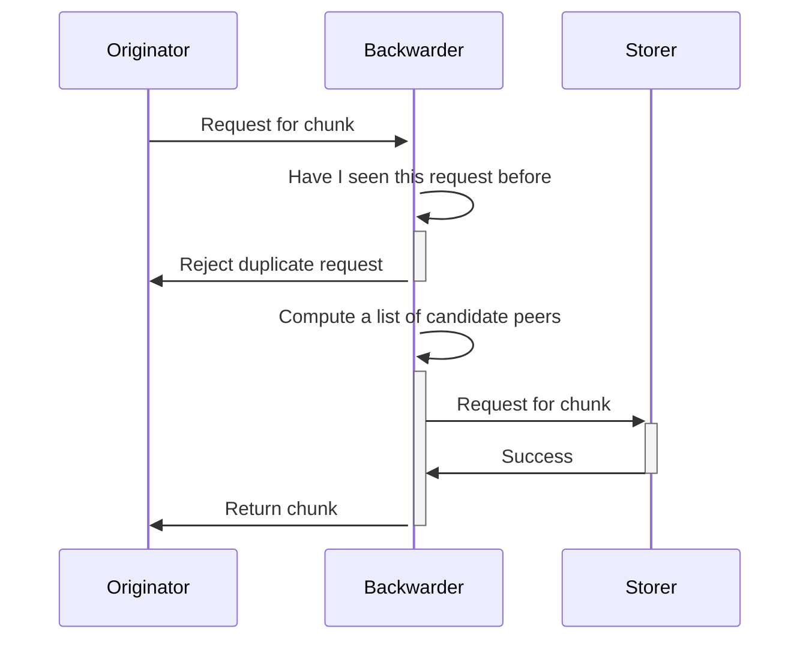
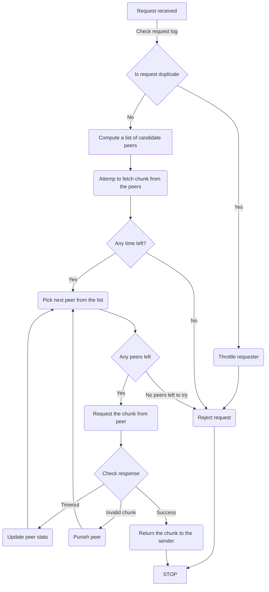

# Protocols specifications

## Abstract

An attempt to describe the desired, theoretical behavior of the main DISC protocols.
We'll begin with describing Retrieval, PushSync, PullSync and Kademlia communication protocols but eventually this should be expanded to cover all protocols fully.
Ideally we should always think in terms of how we could design and implement the protocols in such a way that simultations could be written allowing us to validate the protocol rules and behaviour, as well as allow us to test any potential improvements.

## Introduction

A communications protocol is a set of formal rules describing how to transmit or exchange data, especially across a network.
While ideally specialized tools (TLA+ etc) could be employed to verify the correctness of the specifications, at this point in time, with the resources at hand we might want to limit ourselves with building some kind of a simultation framework that would allow us to validate how a collection of in-memory nodes talk to each-other using a given protocol.

## Proposal

At the moment there isn’t a single source of truth about WHATs and HOWs of the DISC protocols.
There is the observed behavior that is coded into the repository inherited from the previous iterations of the project - however - except for the high level description of the expectations that can be found in <a href="/the-book-of-swarm.pdf" target="_blank" rel="noopener noreferrer">The Book of Swarm</a> - there’s no specific, tangible and actionable documentation that we can referred to when implementing and reasoning about specific protocols.
This is not an optimal situation for successful development because on the code level an observer would look at both the WHYs and the HOWs, concepts that are easy to confuse and even easier to misinterpret in a multi-threaded environment like ours.

The purpose of this document is to specify these concepts:

- A pattern of exchange of messages which in semantic units correspons to the high level function of what a node accomplishes in an exchange.
- Strategies of behavior that a node should adopt in situations like network disconects, timeouts, invalid chunks etc.
- An incentivisation strategy such that constructive behavior should be rewarded and encoraged while deviating from the protocol rules should result in punishing measures.

footnote --
All of this above should resemble the functioning of an FSA

# Protocols

## Retrieval

The retrieval of a chunk is a process which fetches a given chunk from the network by its address. Since Swarm involves a direct storage scheme of fixed size where chunks are stored on nodes with address corresponding to the chunk address the retrieval protocol involves reaching those neighborhoods wherever the request is initiated. Such a route is sure to exist as a result of the Kademlia topology of keep-alive connections between peers. The process of relaying the request from the initiator to the storer is called forwarding and also the process of passing the chunk data along the same path is called backwarding. If we zoom into a particular node in the forwarding path we see the following strategy:

- Receive a retrieve request
- Decide who to forward the request to (decision strategy)
- Have a way to match the the response to the original request

The crucial step is the second one - strategy of choosing the peer to forward the request to and how they react to failure like stream closure or nodes dropping offline or closing the protocol connection and whether we proactively initiate several requests to peers.

Backwarding and Forwarding are both notions defined on a keep alive network of peers as strategies of reaching certain addresses.

The key elemement of these notions is that the decision about the next action is being done on the node level, which will select the next peers(s) and delegate them with handling the request.

### Requirements

- We need a way to ensure that this request has not been received recently (enough) before. Are we dealing with a spamming attack?
- We need a way to determine the "best" candidate peer to forward the request to, and if this option fails, continue with the "next-best" candidate until we exhaust available peers. The decision of picking the "best" peer is delegeate to an overlay driver that has the best knowledge of this peer's past history and performance and topology structure.
- We need a strategy of parallelisation of retrieval requests that we pass downstream, where appropriate. Parallel requests to different peers allow us increase the chances of successfully retrieving the chunk but it comes with the cost of using our bandwidth allowance, so it's imperative to zoom in on an optimal balance between the two.
- We need a way to ensure that when we issue a retrieval request we don’t end up in a situation when this request comes back around to us, wasting network resources.
- In the case when we are a “backwarder” node, we might consider a decision strategy on whether we want to cache the chunk in the event of a repeated request.
- To every forwarding/backwarding exchange we attach an incentivisation action that would take into account variables like the success of the action and the cost of performing the action.
- We need to design the optimal incentivisation scheme, to determine the optimal payment/settlement frequency and correctness of computation of the payment/charged amount. This also applies to both chunk storage scheme and the relayed request-response scheme.
- We need to have a sensible strategy when it comes to waiting for a node to respond to our request; as a backwarder, we want to make our best effort to retrieve the chunk but without waiting for an excessive amount of time, which would lead to waste of resources.

### Protocol breach

- If we determine that the requested chunk is non-existing we need a strategy of rate limiting in order to discourage resource wasteful actions.
- Receiving a response in the form of an invalid chunk constitutes a protocol breach and punishing measures are being taken against the peer at fault.
- If we receive a response to an expired request, or we are unable to conclude if such a request has ever been issued, this would be considered a protol breach and punishing measures should be imposed on the upstream peer.

### Retrieve request steps

```markdown
step I
1) check if this exact request has been received withing last N minutes
2) if such request is found and has been satisfied previously DO take punishing measures against the requester (blocklisting)

step II
1) using a given selection strategy (TDB) select a peer from our peer store
2) for each selected peer we execute action 'request chunk' defined below
3) if we exhaust the list of peers (candidates) for this action, return a 'failure to get chunk' response to the requester. We might consider increasing our peer connections pool to avoid such situation in the fugure
4) if we are able to conclude that the chunk is non-existent (TBD) we return 'chunk not found' to the requester and consider rate limiting measures against the requester.
```

### Request chunk from peer

```markdown
1) if we ran out of allowed time while looking for the chunk we return a 'timeout' response to the requester
2) if the chunk is retrieved successfully but does not pass validation, take punishing measures against the peer (blocklisting).
3) if the chunk is valid, log the event details in the local state and return the chunk to the requester
4) consider caching the chunk in case there might be a repeated request for it
5) if the attempt fails, log the relevant attempt details in the local state and repeat the attempt against a new peer
6) if the peer times out responding to our request we log the attempt details and repeat step II against a new peer
```

:::info
To consider: using a ring buffer as the data structure for keeping track of the past retrieval request (requestLog).
This would enable us to have a predictable memory allocation strategy.
:::

### Simplified request chunk sequence diagram



### Request chunk flow diagram



### Appendix

The protobuf definitions

```protobuf
message Request {
  bytes Addr = 1;
}

message Delivery {
  bytes Data = 1;
  bytes Stamp = 2;
}
```

## Pushsync

Appendix: the protobuf definitions

## Pullsync

Appendix: the protobuf definitions

## Kademlia

Appendix: the protobuf definitions
