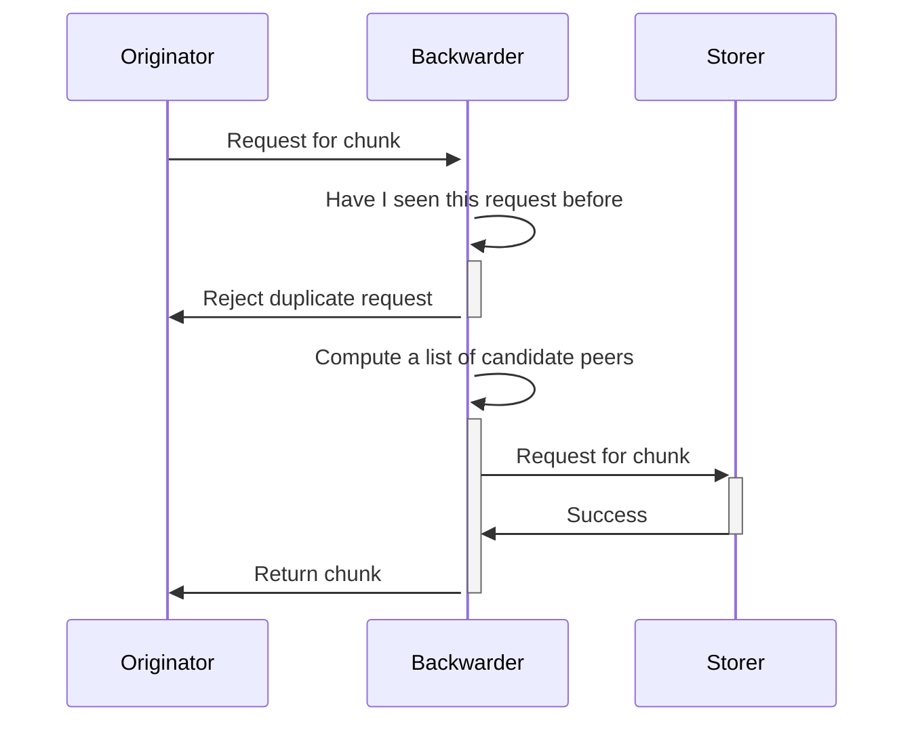
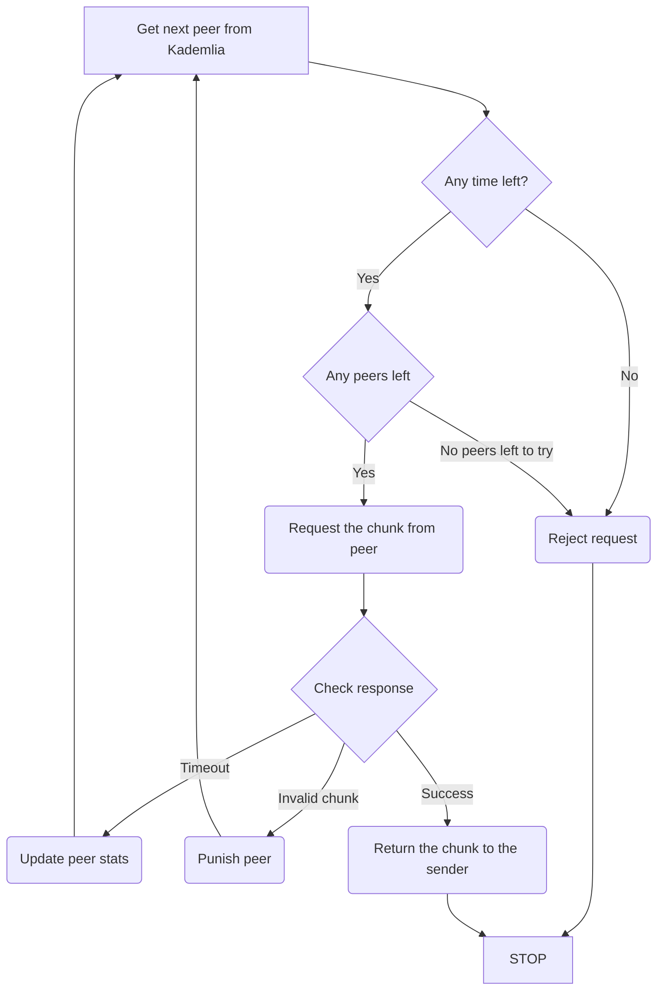

# Protocols specifications

## Abstract

An attempt to describe the desired, theoretical behavior of the main DISC protocols.
We'll begin by describing Retrieval, PushSync, PullSync and Kademlia communication protocols but eventually this should be expanded to cover all protocols fully.
Ideally we should always think in terms of how we could design and implement the protocols in such a way that simultations could be written allowing us to validate the protocol rules and behaviour, as well as allow us to test any potential improvements.

## Introduction

A communications protocol is a set of formal rules describing how to transmit or exchange data, especially across a network.
While ideally specialized tools (TLA+ etc) could be employed to verify the correctness of the specifications, at this point in time, with the resources at hand we might want to limit ourselves with building some kind of a simultation framework that would allow us to validate how a collection of in-memory nodes perform when collaborating via a given protocol.

## Proposal

At the moment there isn’t a single source of truth about WHATs and HOWs of the DISC protocols.
There is the observed behavior that is coded into the repository inherited from the previous iterations of the project - however - except for the high level description of the expectations that can be found in <a href="/the-book-of-swarm.pdf" target="_blank" rel="noopener noreferrer">The Book of Swarm</a> - there’s no specific, tangible and actionable documentation that we can referred to when implementing and reasoning about specific protocols.
This is not an optimal situation for successful development because on the code level an observer would look at both the WHYs and the HOWs, concepts that are easy to confuse and even easier to misinterpret in a multi-threaded environment like ours.

The purpose of this document is to specify these concepts:

- A pattern of exchange of messages which in semantic units correspons to the high level function of what a node accomplishes in an exchange.
- Strategies of behavior that a node should adopt in situations like network disconects, timeouts, invalid chunks etc.
- An incentivisation strategy such that constructive behavior should be rewarded and encoraged while deviating from the protocol rules should result in punishing measures.

footnote --
All of this above should resemble the functioning of an FSA

# Protocols

## Retrieval

The retrieval of a chunk is a process which fetches a given chunk from the network by its address. Since Swarm involves a direct storage scheme of fixed size where chunks are stored on nodes with address corresponding to the chunk address the retrieval protocol involves reaching those neighborhoods wherever the request is initiated. Such a route is sure to exist as a result of the Kademlia topology of keep-alive connections between peers. The process of relaying the request from the initiator to the storer is called forwarding and also the process of passing the chunk data along the same path is called backwarding. If we zoom into a particular node in the forwarding path we see the following strategy:

- Receive a retrieve request
- Decide who to forward the request to (decision strategy)
- Have a way to match the the response to the original request

The crucial step is the second one - strategy of choosing the peer to forward the request to and how they react to failure like stream closure or nodes dropping offline or closing the protocol connection and whether we proactively initiate several requests to peers.

Backwarding and Forwarding are both notions defined on a keep alive network of peers as strategies of reaching certain addresses.

The key elemement of these notions is that the decision about the next action is being done on the node level, which will select the next peers(s) and delegate them with handling the request.

The simplest representation of this would be a recursive algoritm that with every iteration gets closer to the target address and stops when it runs out of peers or successfully reaches the target node.

### Requirements

- We need a way to determine the "best" candidate peer to forward the request to, and if this option fails, continue with the "next-best" candidate until we exhaust available peers. The decision of picking the "best" peer is delegeate to an overlay driver that has the best knowledge of this peer's past history and performance and topology structure.
- We need a strategy of parallelisation of retrieval requests that we pass downstream, where appropriate. Parallel requests to different peers allow us increase the chances of successfully retrieving the chunk but it comes with the cost of using our bandwidth allowance, so it's imperative to zoom in on an optimal balance between the two.
- We need a way to ensure that when we issue a retrieval request we don’t end up in a situation when this request comes back around to us, wasting network resources.
- In the case when we are a “backwarder” node, we might consider a decision strategy on whether we want to cache the chunk in the event of a repeated request.
- To every forwarding/backwarding exchange we attach an incentivisation action that would take into account variables like the success of the action and the cost of performing the action.
- We need to design the optimal incentivisation scheme, to determine the optimal payment/settlement frequency and correctness of computation of the payment/charged amount. This also applies to both chunk storage scheme and the relayed request-response scheme.
- We need to have a sensible strategy when it comes to waiting for a peer to respond to our retrieval request; as a backwarder, we want to make our best effort to retrieve the chunk but without waiting for an excessive amount of time, which would lead to waste of resources.

### Protocol breach

- Receiving a repeated request for a non-existent chunk should lead to rate limiting in order to discourage resource wasteful actions.
- Receiving a response in the form of an invalid chunk constitutes a protocol breach and punishing measures are being taken against the peer at fault.
- Receiving a response to an expired request, or we are unable to conclude if such a request has ever been issued - punishing measures should be imposed on the upstream peer.

### Retrieve request steps

```markdown
step I
1) check if this exact request has been received withing last N minutes and it is for a non-existent chunk
2) if such request is found - take punishing measures against the requester (blocklisting)
3) request a peer from Kademlia
4) request chunk from the peer
5) if the peer does not return a valid chunk - go back to step 3
6) if the chunk is found and valid, log the event details in the local state and return the chunk to the requester
7) consider caching the chunk in case there might be a repeated request for it

Error states
- if we exhaust the list of peers (candidates) for this action, return a 'failure to get chunk' response to the requester. We might consider increasing our peer connections pool to avoid such situation in the fugure
- if we are able to conclude that the chunk is non-existent (TBD) we return 'chunk not found' and consider rate limiting measures against the requester.
- if we ran out of allowed time while looking for the chunk we return a 'timeout' response to the requester
- if the chunk is retrieved successfully but does not pass validation, take punishing measures against the peer (blocklisting).
- if the attempt fails, log the relevant attempt details in the local state and repeat the attempt against a new peer
- if the peer times out responding to our request we log the attempt details and repeat step II against a new peer
```

### Incentivisation strategy

An incentivisation strategy should be put in place in such way that it encourages honest collaboration between nodes.

This implies that a given peer will make the best effort to satisfy any request while not allowing any abuse and waste of its resources.

Having an accounting component that would keep track of the exchange activity between peers ensures that we do not allow excessive freeloading from the misbehaving peers.

Having a granular punishment strategy ensures that the peers who misbehave perhaps due to network latencies will not be sanctioned to the same extent as peers who engage in grave protocol breaches, but are given a chance to "clean up their act"

TBD

### Simplified request chunk - sequence diagram



### Request chunk from downstream - flow diagram



### Appendix

The protobuf definitions

```protobuf
// Copyright 2020 The Swarm Authors. All rights reserved.
// Use of this source code is governed by a BSD-style
// license that can be found in the LICENSE file.

syntax = "proto3";

package retrieval;

option go_package = "pb";

message Request {
  bytes Addr = 1;
}

message Delivery {
  bytes Data = 1;
  bytes Stamp = 2;
}
```

## Pushsync

Pushsync protocol is responsible for ensuring delivery of the chunk to its prescribed storer after it has been uploaded to any arbitrary node.

It works in a similar way to the Retrieval protocol in the sense that the chunk is being passed to a peer whose address is closest to the chunk address and a custody receipt is received in response.

Then the same process is repeated until the chunk eventually reaches the storer node located in a certain "neighborhood".

Since the Pushsync protocol is a "mirror" version of the Retrieval protocol - it ensures that a successfully uploaded chunk is retrievable from the same "neighborhood" by the virtue of the fact that nodes in a neighborhood are connected to each other.

### Multiplexing

Multiplexing is a recommended node strategy for the push sync protocol that involves early replication and opportunistic receipting. Its intention is to reduce the dependence on single closest nodes and to improve on network performance, i.e., push sync success rate, bandwidth overhead and latency.

#### Context

The current implementation of the push sync protocol aims to push a chunk to the closest node in the neigbhourhood which is then supposed to give out a receipt. This is motivated by the  retrieval protocol that aims to find the chunk at this closest node.

When the closest node hands out a receipt, this node also replicates the chunk to 3 peers in the neigbourhood which are further away from the chunk than him. This replication takes place to ensure that the chunk is not lost when the closest node shuts down before the chunk is not pull-sync'ed and to speed up the spreading of the chunk in the neigbhourhood, in advance of pull sync.

#### Problem

Treating the closest node as a single target of push sync is fragile. If this peer has a malperforming blockchain backend, slow or incomplete connectivity or is malicious, it may not spread the chunk and/or does not respond with a receipt. In this case, currently, the originator must retry the entire push-sync operation many times before the other peers within neigbhorhood recognise the improper behavior.

In-neigbhorhood retries are ideally avoided because such retries might cause the downstream timeouts to expire.

In case of incomplete connectivity, the push sync protocol can end at a different branch of the neigbhorhood than the retrieval protocol--causing the chunk not to be retrievable.

It should be noted that the pull sync protocol (may?) remedies this problem with a small time-delay.

#### Multiplexing: early replication within neighbourhood

The first node in the push sync forward chain that falls within the neigbhorhood acts as *multiplexer*, i.e., it forwards the request to a number of closest nodes and responds with a self-signed receipt.

Thus in achieving retrievability and security via early replication, we do not critically rely on the closest node to be available anymore.

#### Push sync flow

We define the different roles peers have as part of the push sync forwarding chain:

- originator -- creator of the request
- forwarder -- closer to the chunk than the originator, further away away than the 1-before node.
- multiplexer -- first node in the forward chain who is in the neigbhorhood
- closest nodes -- according to the downstream node (usually the multiplexer), within the n closest nodes to the chunks (not including self)

we describe the envisioned flow of push sync by describing the intended behaviour strategy of the various roles.

1. originator sends chunk to a peer closer to the chunk.
2. forwarder(s) forwards chunk that ends up with a node already within the neighbourhood that acts as multiplexer
3. The multiplexer concurrently sends the chunk to 3 closest nodes attaching a multiplexing-list as part of the protocol message. At the same time they respond to their upstream peer with a self-signed receipt (unless the multiplexer is itself the originator).
4. Non-multiplexing closest nodes, i.e., nodes in the neighbourhood that receive the pushsync message from a not-closest neighbour with a multiplexing list included, validate whether, based on their view, the multiplexing list covers all 3 closest nodes (potentially including the peer and/or the upstream peer themselves). If not, the node forwards the chunk to the peers left out. These peers are also added to the multiplexing list received from upstream and the extended list is attached with the chunk pushed.

If the multiplexer node does not know a closest peer *p* but several of its chosen closest nodes do, then that node *p* will receive the same pushsynced chunk multiple times

### Appendix

The protobuf definitions

```protobuf
// Copyright 2020 The Swarm Authors. All rights reserved.
// Use of this source code is governed by a BSD-style
// license that can be found in the LICENSE file.

syntax = "proto3";

package pushsync;

option go_package = "pb";

message Delivery {
  bytes Address = 1;
  bytes Data = 2;
  bytes Stamp = 3;
}

message Receipt {
  bytes Address = 1;
  bytes Signature = 2;
  bytes Nonce = 3;
}
```

## Pullsync

While the other described protocols are request scoped, Pullsync is a subscription stype protocol.

Pullsync's role is to help syncronization of the chunks between neighborhood nodes. It also bootstraps new nodes by filling up their storage with the chunks in range of their storage radius.

There are two kinds of syncing:

- historical syncing: catching up with content that arrived to relevant neighborhood before this session started (after an outage or for completely new nodes).
- live syncing: fetching the chunks that are received after the session has started.

The chunks are served in batches (ordered by timestamp) and they cover contigious ranges.

The downstream peers coordinate their syncing by requesting ranges from the upstream with the help of the "interval store" - to keep track of which ranges are left to be syncronized.

The point of the interval based approach is to cover those gaps that inevitably arise in between syncing sessions.

TBC

### Appendix

The protobuf definitions

```protobuf
// Copyright 2020 The Swarm Authors. All rights reserved.
// Use of this source code is governed by a BSD-style
// license that can be found in the LICENSE file.

syntax = "proto3";

package pullsync;

option go_package = "pb";

message Syn {}

message Ack {
  repeated uint64 Cursors = 1;
}

message Get {
  int32 Bin = 1;
  uint64 Start = 2;
}

message Chunk {
  bytes Address = 1;
  bytes BatchID = 2;
}

message Offer {
  uint64 Topmost = 1;
  repeated Chunk Chunks = 2;
}

message Want {
  bytes BitVector = 1;
}

message Delivery {
  bytes Address = 1;
  bytes Data = 2;
  bytes Stamp = 3;
}
```

## Kademlia

Kademlia topology is a critical component used by all DISC protocols whose purpose is to route messages between nodes in a network using overlay addressing.

The message routing happens in such a fashion that with every network hop we will get closer to the target node, specifically at half of the distance covered by previous hop.

Swarm uses the recursive/forwarding style of Kademlia. This approach implies that every forwarding node - once it received a request - will keep an in-memory record that captures the request related information (requester, time of the request etc.) until the request is satisfied, rejected or times out.

Because a forwarder can not reliably tell how much time the downstream peer will need to satisfy the request - the choice of a resonable value for waiting period is a point of contention.

It is constrained by these factors:

- keeping the in-memory record for too long means that there's going to be a limit on how many concurrent requests a peer can keep "in-flight", because memory is limited.
- if the peer decides to time out prematurely (while downstream peers are still processing the request) then the effort of all the downstream peers will be wasted.
- we should distinguish between unsolicited chunks and chunks that we received from the downstream after we stopped waiting for the response (timed out). After a certain period of time all responses will be treated the same because of the need to free the allocated resources (the in-memory record).

Conversely the downstream should be informed when the upstream is no longer interested in the previously sent request, so it could free the used resources. This way the downstream won't return the chunk after the request has timed out, risking being punished.

### Peer rating

When choosing a peer in relation to a given address - in addition to the distance between them - the Kademlia component will take into account two other factors:

- the historical performance of the given peer, both in terms of latencies and past occurences of protocol misalignments.
- the accounting aspect, peers with whom we have higher credit will be preferred.
- we should also prioritise those downstream peers that managed to produce responses in a previously computed amount of time (that would take into consideration the average time needed for a hop multiplied by the expected number of hops needed to reach a target neighborhood).

Kademila should be indexing peers by their proximity order and peers rating in order to prioritize peers based on their expected performance.

### Decision strategy

An optimal decision strategy will take into account both proximity order and peer rating to select (out of all connected peers) the best one to pass down the request.

At the implementation level the Kademlia component will offer (in exchange for a given address) a stateful iterator that the client (protocol) will use to get the "next-best" peer.

TBD
