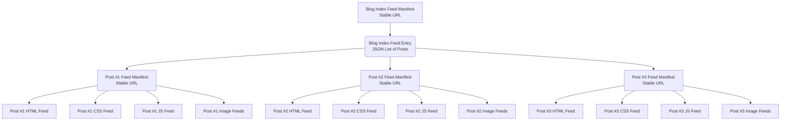

## Using Feeds for Dynamic Content (Single Page Site)

:::info
Although all data on Swarm is immutable, feeds provide an updatable reference that enables dynamic content, simulating a mutable resource which always resolves to its latest update through a static feed manifest reference.
:::

:::tip
This guide relies heavily on the use of Swarm feeds. If you are not already familiar with feeds, it's recommended to familiarize yourself with them. See the [bee-docs feeds section](/docs/develop/tools-and-features/feeds/) for a high level overview and then check the [bee-js-docs feeds section](https://bee-js.ethswarm.org/docs/soc-and-feeds/#feeds) for a more detailed explanation and example implementation.
:::


This guide shows how to create **per-asset feeds** so you can update individual files (header images, CSS, JS bundles, logos, site config, etc.) without re-uploading the entire website. 

This technique effectively turns Swarm into a **decentralized CDN**:  
each asset gets its own permanent reference, and updates flow atomically through feeds.

### Why Use Per-Asset Feeds?

Traditional upload-and-replace workflows require re-deploying everything, even if only one asset changes. With Swarm feeds:

- Every file can have its own independent "channel" (feed topic).
- Each feed has a **stable manifest hash** that never changes.
- When you update an asset, only that feed is updated.  

This gives you:

- Faster and smaller updates  
- Zero ENS updates  
- No-downtime asset changes  
- A decentralized CDN-like architecture

### Architecture Overview

For a typical site:

| Asset           | Feed Topic        | Purpose |
|----------------|-------------------|---------|
| Main website   | `website`         | Full site HTML/JS/CSS bundle |
| Header image   | `header-image`    | Frequently changed graphic |
| CSS theme      | `main-css`        | Style updates |
| JS bundle      | `main-js`         | Client logic |
| Config JSON    | `site-config`     | Dynamic data |

Each of these gets:

- its own private key  
- its own topic  
- its own feed manifest  
- its own permanent URL  


### Generate Publisher Keys

Every feed should have its own publishing key.

```js
import crypto from "crypto";
import { PrivateKey } from "@ethersphere/bee-js";

const hexKey = '0x' + crypto.randomBytes(32).toString('hex');
const pk = new PrivateKey(hexKey);

console.log("Private key:", pk.toHex());
console.log("Address:", pk.publicKey().address().toHex());
```

### Create a Feed Per Asset

Example: header image.

```js
import { Bee, PrivateKey, Topic } from "@ethersphere/bee-js";

const bee = new Bee("http://localhost:1633");
const batchId = "<BATCH_ID>";

const pk = new PrivateKey("<HEADER_PRIVATE_KEY>");
const topic = Topic.fromString("header-image");
const owner = pk.publicKey().address();

const writer = bee.makeFeedWriter(topic, pk);
```

### Upload Asset + Publish Feed Update

```js
const upload = await bee.uploadFile(batchId, "./assets/header.jpg");
await writer.uploadReference(batchId, upload.reference);

const manifest = await bee.createFeedManifest(batchId, topic, owner);
console.log("Header Manifest:", manifest.toHex());
```

Stable URL:

```
bzz://<HEADER_MANIFEST_HASH>/
```


### Updating the Asset

```js
const newUpload = await bee.uploadFile(batchId, "./assets/header-new.jpg");
await writer.uploadReference(batchId, newUpload.reference);
```

Manifest stays the same.


### Reference Asset Feeds in HTML

```html
/" alt="Header" />
<link rel="stylesheet" href="bzz://<CSS_MANIFEST_HASH>/" />
<script src="bzz://<JS_MANIFEST_HASH>/"></script>
```


## Hierarchical Feed-Indexed Page Manifests (Multi-page Site)

In this pattern, you build a **fully dynamic blog** where:

* The blog homepage is served from **one feed manifest**
* The list of posts comes from **another feed** (the “post index”)
* Each blog post lives at its own **independent feed manifest**
* And each post’s internal assets (HTML, CSS, JS, images, metadata, etc.) are also updated through **their own feeds**

This creates a structure like:



This is a **literal feed of feed manifests**, but described in a way that’s directly tied to the practical outcome: a fully dynamic, updatable blog where *every moving part can change independently*.


### Dynamic Blog Structure (Feed-Indexed Manifests)

A dynamic blog is built by combining multiple levels of Swarm feeds:

#### **1. Top-level: Blog Feed Manifest (your main website URL)**

This is the stable URL you give to users. It loads your SPA (React + hash routing).
Your frontend then fetches the blog index.

#### **2. Blog Index Feed (list of posts)**

This feed contains a JSON array of **feed manifest addresses**, one per post.

Example `posts.json` stored inside the index feed:

```json
{
  "posts": [
    "0xPOST1_MANIFEST",
    "0xPOST2_MANIFEST",
    "0xPOST3_MANIFEST"
  ]
}
```

Update this feed whenever you add or remove posts.

#### **3. Blog Post Manifests (one per post)**

Each post gets its own feed manifest which always points to its latest version.

Each post contains:

* the post HTML (also a feed)
* post-specific CSS (feed)
* post-specific JS (feed)
* post images (feeds)
* metadata JSON (feed)

Your structure might look like:

```
post-1/
  post.html   → feed
  style.css   → feed
  main.js     → feed
  cover.jpg   → feed
  metadata.json → feed
```

All bundled into **one feed manifest for the post**, so the post has a single stable URL.

#### **4. Optional: ENS Integration**

Each post can also have an ENS subdomain if desired:

```
post1.blog.eth     → post 1 feed manifest
post2.blog.eth     → post 2 feed manifest
```


### How the Frontend Uses These Feeds

Inside your React app (using [`HashRouter`](/docs/develop/host-your-website#client-side-routing)), you would:

1. Load the **post index feed**
2. Display the list of posts
3. When the user navigates to `/#/post/<id>`, load that post’s feed manifest
4. Render its HTML + assets

This gives you:

* **fully dynamic content**
* posts you can update individually
* a blog you can expand infinitely
* stable URLs for *every* level of content
* no need to reupload the main site for a new post


### In Summary

> A dynamic blog is built using a *feed-indexed set of page manifests*:
> one feed acts as the post index, and each post has its own feed manifest that points to its latest version. Inside each post, the HTML, CSS, JS, images, and metadata are each stored in their own feeds so everything can update independently.


